# QR Reward Platform — System Design

A teaching document. It explains *what* this system is, *how* it is built, and — for every
non-obvious decision — *why it could not have been simpler*.

Companion documents: [README.md](README.md) to run it, [SYSTEM_FLOW.md](SYSTEM_FLOW.md) for the
narrative/product view and the publisher integration guide. This document is the engineering
view: architecture, data model, algorithms, concurrency, security, operations.

---

## 0. How to teach this

| Time you have | Read |
|---|---|
| 5 minutes | §1 The problem, §2 Context diagram |
| 20 minutes | + §3 Architecture, §5 The four-stage pipeline, §7 The scan |
| 60 minutes | + §8–§11 the three payout flows, §12 Money |
| Deep dive | Everything, then §20 exercises |

The single sentence to open with:

> A brand pays an app for users. A QR code is the bridge — but the QR **unlocks nothing**, so
> the whole system is about proving, after the fact and server-to-server, that a scan and an
> install were the same phone.

Everything difficult in this codebase descends from that one constraint.

---

## 1. The problem, and the constraint that shapes it

### The business

Two products share one machine:

| | `acquisition` | `engagement` |
|---|---|---|
| Promoter pays for | a person who was not a user before | a repeat purchase by anyone |
| Guarantee | one payout per user per campaign, **ever** | one payout per **issued code** |
| Priced at | `coin_rate` (verified) / `guest_rate` (unverified) | `engagement_rate` |
| Codes | designed in a portal, printed, many scans | minted per transaction by the promoter's server, single-use |
| How it is matched | An opaque `claim_id`, carried by Play's install referrer, an App Clip container, or the pasteboard | the code itself |
| Stages | scan → install → signup → reward | scan → reward |
| Example | a poster in an airport terminal | a code on every boarding pass |

A campaign picks its `mode` at creation and it never changes — there is no endpoint to change
it, because the payout guarantees are *partial unique indexes* over rows that already exist,
and flipping the mode would leave paid rows living under a rule they were never checked against.

### The constraint

App Store Review Guideline 3.1.1 forbids apps unlocking content with "their own mechanisms…
such as license keys, augmented reality markers, **QR codes**". Google Play ties virtual
currency to the app it was bought in.

So the design rule is absolute: **a scan hands the phone nothing it can spend.** No token, no
key, no grant. The redirect goes to a store listing (or the publisher's own app link), and the
question "was that install ours?" is answered afterwards, between two servers, authenticated by
an API key that lives only on the publisher's backend.

That is why this system needs an attribution engine at all. If the QR could carry a redeemable
code, all of §8–§10 would be twenty lines.

---

## 2. System context

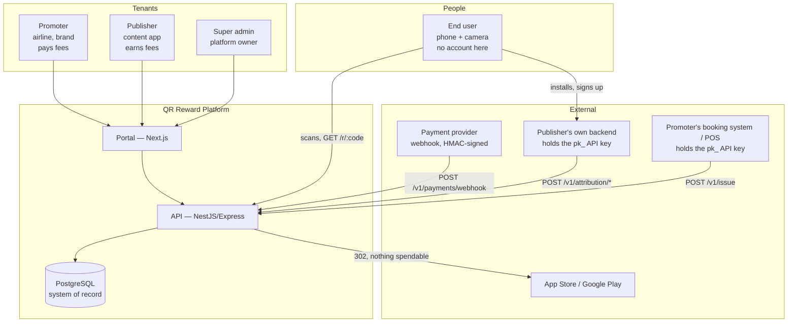

**Read the arrows carefully.** The end user's phone touches this platform exactly once, on the
redirect. Every statement about money comes from a *server* holding an API key. The phone is
never trusted with anything, because it cannot be.

### The four actors

| Who | Wants | Credential |
|---|---|---|
| **Promoter** | signups / repeat purchases on a partner app | session JWT + `pk_…` key for `/v1/issue` |
| **Publisher** | to be paid per attributed signup | session JWT + `pk_…` key for `/v1/attribution/*` |
| **End user** | to install an app | none — never touches the API directly |
| **Super admin** | oversight, overrides, an audit trail of both | session JWT with `admin` role, seeded from env |

One login per company (`orgs` table, single-user tenancy). Split out a `users` table when teams
matter — it does not yet.

---

## 3. Architecture

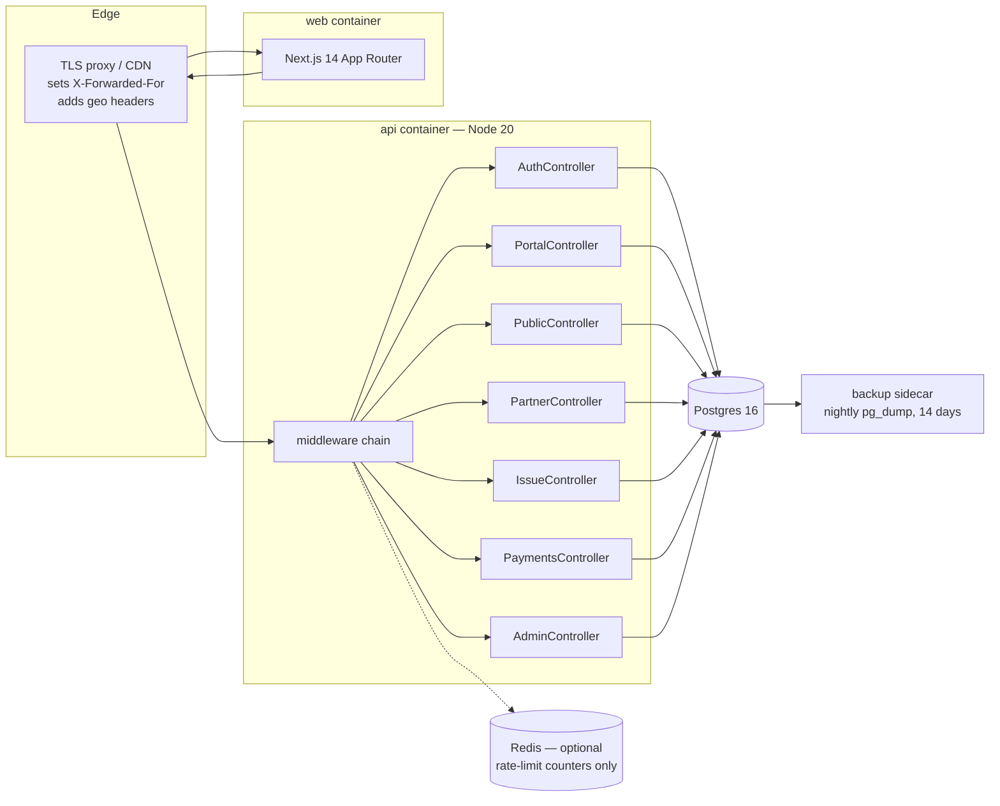

### Stack, and why

| Layer | Choice | Note |
|---|---|---|
| API | NestJS 10 on Express | one `AppModule`, seven controllers, **no providers** — nothing to scope, so feature modules would be five files of boilerplate |
| ORM | Prisma 7 + `@prisma/adapter-pg` | the pool is ours to tune; every money path drops to `$queryRaw` for `FOR UPDATE` |
| DB | PostgreSQL 16 | the *only* stateful dependency; it holds every invariant |
| Cache | Redis, **optional** | counts rate limits and nothing else. No read path falls back to it, so a cold Redis costs throttling accuracy and zero correctness |
| Web | Next.js 14 + Tailwind 4 | portal, admin console, landing, publisher simulator |
| Docs | `@nestjs/swagger` at `/docs` | generated from live controllers; **off by default in production** (it enumerates every route = free reconnaissance) |

### The middleware chain — order is load-bearing

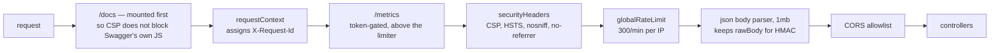

Four ordering decisions worth teaching:

1. **`requestContext` first** — so every log line and even a 429 already carries a request id.
2. **`/metrics` above the rate limiter** — a throttled scrape blinds monitoring exactly when
   traffic is interesting. `/healthz` is exempt for the same reason: a 429'd health check turns
   a traffic spike into a pulled-from-rotation outage.
3. **Rate limit *before* the body parser** — a flood should be refused without first buying it
   1 MB of JSON parsing per request.
4. **`bodyParser: false` on `NestFactory.create`** — Nest registers its own parser during
   `listen()`, i.e. *after* every `app.use` above. Leaving it on put a second parser behind the
   first and made rule 3 true only by accident.

Nest is also created with a global `PrismaExceptionFilter`: every route takes a uuid from the
URL, so a malformed one reaches Postgres as an invalid literal and would otherwise 500. The
filter translates driver codes (`P2023`, `P2002`, `P2025`, raw `22P02`) into the 4xx they
actually are — once, instead of a `ParseUUIDPipe` on ~20 params that the next route would forget.

### Process lifecycle

- **Boot**: `seedAccounts()` (admin from env; demo tenants only outside production) → create
  app → mount middleware → listen → `startReconciliation()`.
- **Schema**: owned by `prisma migrate deploy`, run *before* the process starts. The app never
  migrates at boot.
- **Shutdown**: `SIGTERM`/`SIGINT` drain in-flight requests before exit — a redeploy
  mid-transaction would otherwise leave a QR use claimed with no redemption written against it.

---

## 4. Domain model

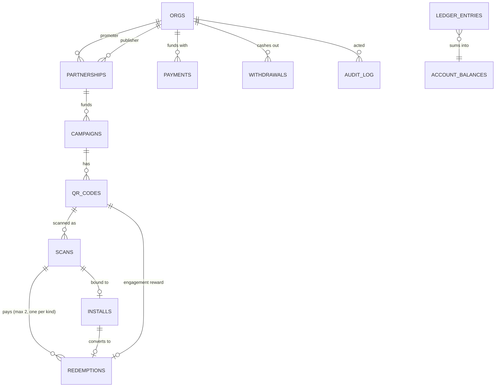

### Table by table

| Table | Holds | The interesting column |
|---|---|---|
| `orgs` | every tenant: promoter, publisher, admin | `api_key_hash` (sha256, never the key), `approved` (publishers are vetted in prod), `deeplink_url` |
| `partnerships` | the commercial deal | four rates + three `proposed_*` rates + `platform_fee_bps` snapshotted at creation |
| `campaigns` | a funded run under a partnership | `mode`: `acquisition \| engagement` |
| `qr_codes` | one printed design, or one minted transaction code | `issued_ref` (the promoter's PNR/order id — the idempotency key), `max_uses`, `uses` |
| `scans` | **an attribution claim waiting to be matched** | `claim_id`, hashed `ip`, `consumed`, the five matching signals, plus reporting dimensions |
| `installs` | first app open, tied back to a scan | `match_method` (which carrier), `confidence`, `redeemed` |
| `redemptions` | a fee was earned | `kind`, `coins`, `identified`, `match_method`, `confidence` |
| `ledger_entries` | **append-only double-entry book** | `(account, ref)` UNIQUE — the replay guard |
| `account_balances` | materialised sum, locked on every money path | `CHECK balance >= 0` except `external:funding` |
| `payments` | intent to fund, completed by a PSP webhook | `provider_ref` partial-unique |
| `withdrawals` | publisher asking to be paid out | `status`, gated by the settlement window |
| `audit_log` | every privileged override | `acknowledged_at` — the admin's inbox mark |

### Two schema conventions worth stealing

**Field names are snake_case and identical to the column names.** Rows go straight to the
frontend as JSON; camelCasing in Prisma would rename every JSON key.

**The important constraints are not in `schema.prisma`.** CHECK constraints and *partial*
unique indexes live in migration SQL, because Prisma cannot express either. The schema is
applied with `migrate deploy` against the SQL, never regenerated from the models. Declaring
`@@unique([campaign_id, publisher_user_ref])` in the schema would create a **total** index and
silently re-impose "one payout per user ever" on engagement rows — the exact thing the second
product exists to allow.

---

## 5. The four-stage pipeline

This is the core idea of the whole system. Each stage is **its own table**.

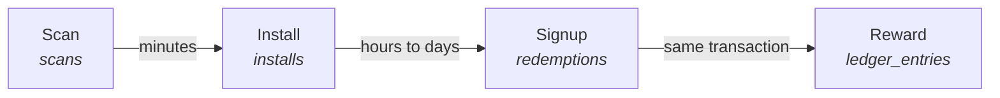

### Why matching moved to first open

Matching used to happen at signup, in the same call that paid the fee. On Android that was
harmless — the referrer names the exact scan whenever it arrives. On iOS it was fatal:

- A scan and a **first open** are minutes apart, and the claim is only readable at that moment:
  an App Clip's container is migrated once, and the pasteboard holds one thing at a time.
- A scan and a **signup** are routinely a day apart: install, onboarding and registration all
  sit between them.

One window cannot honestly cover both. Short enough to be truthful, it matched almost nothing.
Wide enough to catch real installs, it was matching strangers behind the same carrier NAT.

So the pipeline splits:

| Leg | Window | Config |
|---|---|---|
| scan → first open, deterministic | 30 days | `REFERRER_WINDOW_DAYS` |
| first open → signup | 30 days | `SIGNUP_WINDOW_DAYS` |

**No money moves until signup.** An install that never signs up earns nobody anything and
simply expires.

---

## 6. Setup flow: partnership → campaign → funding

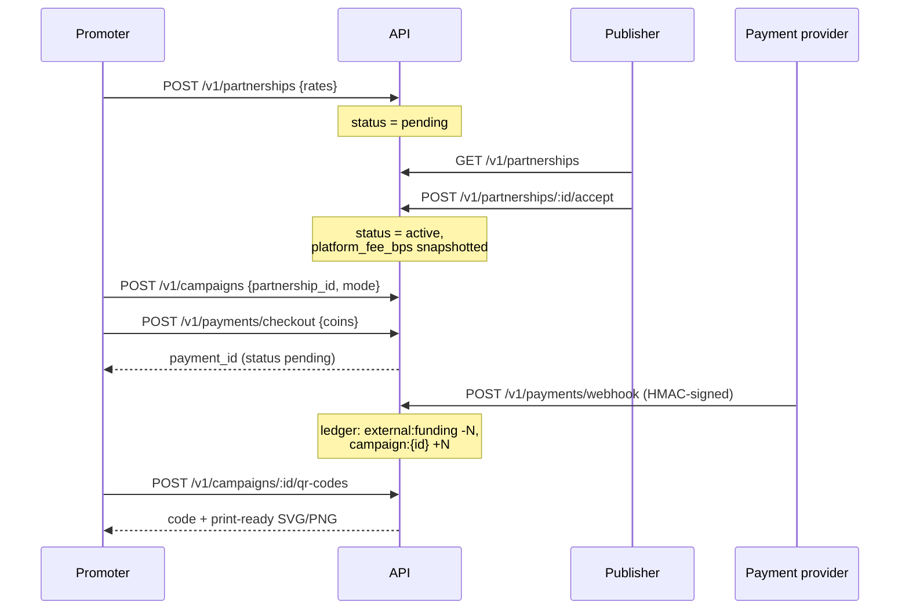

### State machines

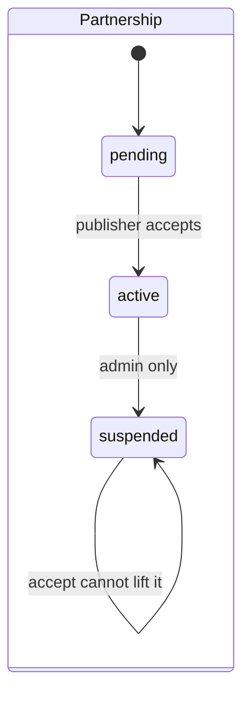

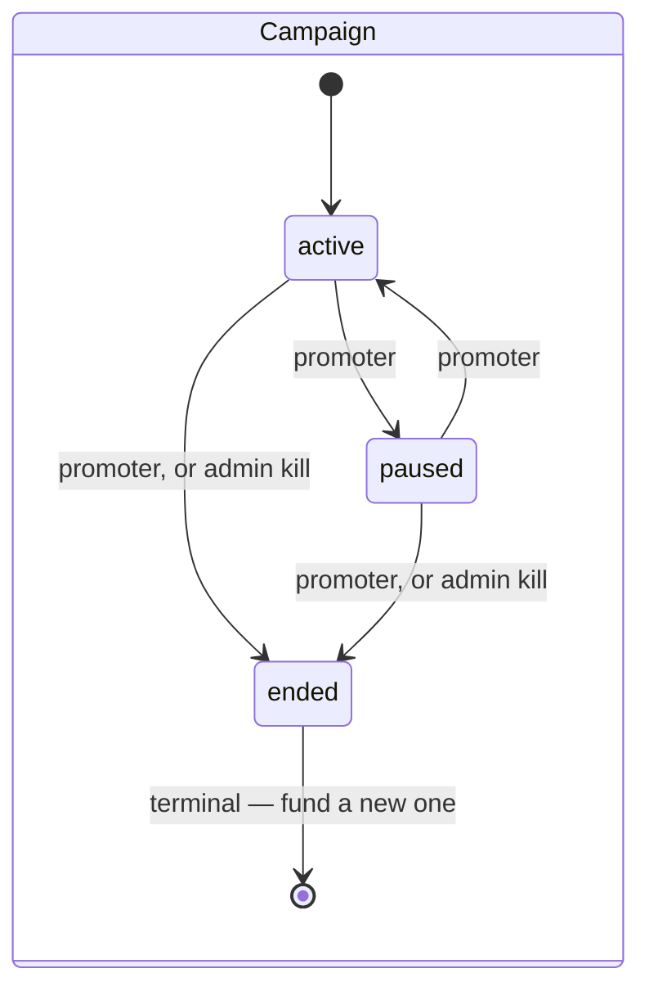

`pending` means exactly one thing: *waiting on the publisher*. An admin freezing a relationship
uses `suspended`, which `accept` cannot lift — otherwise the suspension lever would be a
suggestion.

### Repricing is a proposal, not an edit

`PATCH /v1/partnerships/:id/rates` writes `proposed_coin_rate` / `proposed_guest_rate` /
`proposed_engagement_rate` and **nothing pays out at those numbers**. The live rates stay in
force until the publisher accepts, which copies them over and clears the proposal. A CHECK
constraint refuses half a pair, so a proposal can never exist with only one number in it, and
the `guest_rate <= coin_rate` rule is checked on the pair.

### The four numbers

| Setting | Default | Means |
|---|---|---|
| `coin_rate` | 50 | fee for a **verified** signup |
| `guest_rate` | 10 | fee paid immediately for an **unverified** one |
| `grace_days` | 7 | how long the publisher has to confirm and release the delta |
| `engagement_rate` | 20 | fee for one repeat purchase |

`guest_rate <= coin_rate` is a **database CHECK**, because the guest rate is a *part* of the
coin rate — the held-back delta must never be negative. `engagement_rate` is deliberately
unbounded against either: a repeat purchase is not part of an acquisition, it is a different
thing being bought, and a partnership may honestly price it above a signup or at a tenth of one.

---

## 7. The hot path: what happens on a scan

`GET /r/:code` is the only endpoint a phone ever calls. It **fails closed**: anything unclear
turns the user away with a reason rather than a broken page.

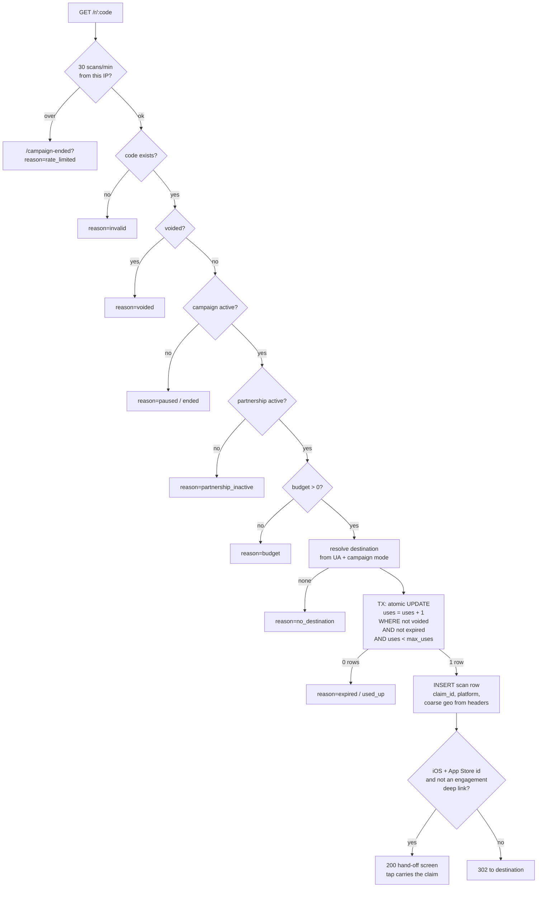

### Two details carry the whole compliance argument

**The destination is resolved before a use is burned.** A publisher who has registered no app
and no web fallback would otherwise eat a print run's uses redirecting nobody.

**The redirect carries nothing spendable.** On Android an opaque `qrm_claim` id rides inside
Play's `referrer` parameter — an install-attribution channel, not app content. On iOS there is
no such channel, so the URL is the bare store listing. Either way the app receives no code it
could redeem.

### Destination resolution

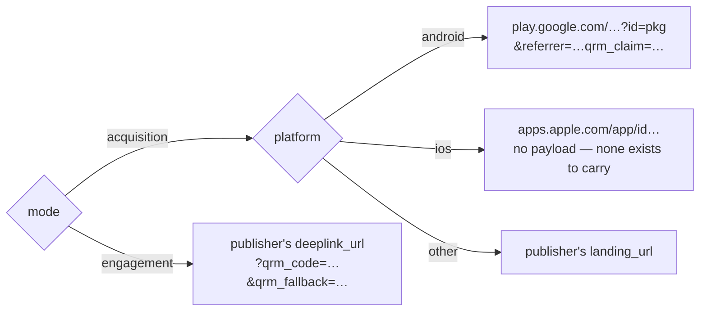

Every check *above* the destination line is identical in both modes, deliberately: budget,
status, expiry, single-use and the per-IP ceiling are money and abuse controls, and an
engagement campaign is not a reason to relax any of them. **`mode` changes where a scan is sent
and nothing else about this path.**

### Claiming a use is one conditional UPDATE

```sql
UPDATE qr_codes SET uses = uses + 1
WHERE id = $1 AND NOT voided
  AND (expires_at IS NULL OR expires_at > now())
  AND (max_uses IS NULL OR uses < max_uses)
RETURNING uses
```

Raw SQL because `uses < max_uses` compares two columns. This single statement is the expiry
check *and* the single-use check *and* the concurrency guard — two simultaneous scans can never
both take the last use of a code. The scan row is inserted in the same transaction, because a
use claimed without its scan row is a burned use of physical print media that can never be
attributed.

---

## 8. Flow A — Android acquisition (deterministic)

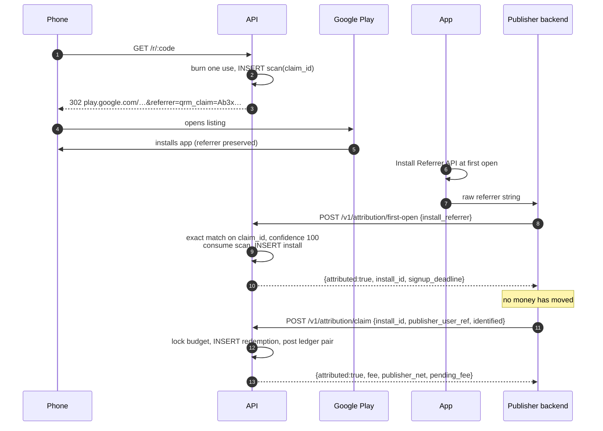

The matching query is worth reading in full, because every clause is a control:

```sql
SELECT s.id, s.campaign_id, c.name, c.status, p.coin_rate, p.guest_rate, …
FROM scans s
JOIN campaigns c    ON c.id = s.campaign_id
JOIN partnerships p ON p.id = c.partnership_id
WHERE s.claim_id = $1
  AND s.consumed = false                       -- one install per scan
  AND p.publisher_org_id = $2                  -- tenant isolation, in the WHERE
  AND p.status = 'active'                      -- suspension stops payouts now
  AND s.scanned_at > now() - interval '30 days'
FOR UPDATE OF s SKIP LOCKED                    -- concurrent claims cannot both proceed
```

`SKIP LOCKED` rather than plain `FOR UPDATE`: two concurrent claims must not queue behind each
other and then both proceed against the same row. The loser skips it and comes back
unattributed, which is the correct answer.

---

## 9. Flow B — iOS acquisition (two carriers, both deterministic)

The App Store has no referrer channel: nothing can be handed *through* it. So on iOS the claim
travels **beside** the store hop instead, carrying the identical opaque `claim_id` Android
carries in Play's referrer.

### What this replaced

Until now this flow was probabilistic. The interstitial read the handset's timezone, screen
geometry, locale, core count and appearance; the publisher's SDK re-presented the same values
at first open; the platform scored them against stored scans behind a confidence floor.

That is device fingerprinting. Apple's Developer Program License Agreement forbids deriving
data from a device for the purpose of uniquely identifying it, and the App Store guidance names
*"properties of a user's web browser and its configuration, the user's device and its
configuration, the user's location, or the user's network connection"* as examples — which was
that signal list exactly. Three things closed every escape route we considered:

- **Purpose, not accuracy.** Collecting data *solely to generate a fingerprint* is named as not
  allowed, so making the match coarser or less reliable would not have helped.
- **Consent does not cure it.** WWDC22: *"Regardless of whether a user gives your app
  permission to track, fingerprinting … is not allowed."*
- **Collecting it on the web did not move it outside the rule.** The prohibition binds the
  developer, and reaches apps that merely *reference* an SDK doing this — which put every
  publisher integrated here inside the blast radius, not just this platform.

So it was deleted rather than tuned: the scoring functions, the `scans` columns that stored
their inputs (`ip`, `tz`, `screen`, `cores`, `dark`), `installs.device_hash`, and the browser
code that read them. A migration strips the same values out of existing rows, and
`attribution.test.ts` fails if any of those names returns to the module's exported surface.

### Carrier 1 — App Clip (preferred: no prompt, nothing visible)

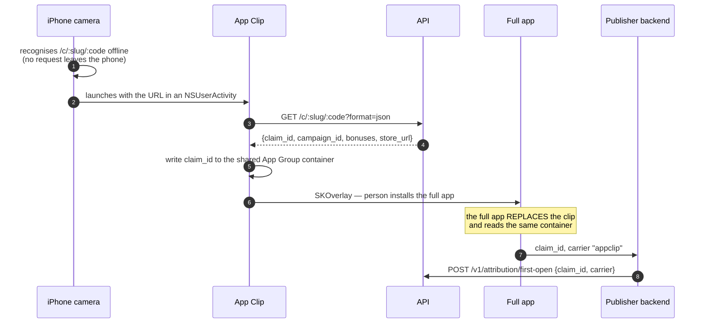

The platform hosts one `/.well-known/apple-app-site-association` listing every registered
publisher's clip — Apple's documentation is explicit that the array may hold more than one — and
each publisher registers its own `/c/<slug>/` prefix in App Store Connect, which routes by
longest prefix match. The slug is UNIQUE in the database, because two publishers sharing one
would hand each other's scans to the wrong clip.

> **ponytail: one shared domain.** If App Store Connect ever refuses two apps registering
> different prefixes on one host, the fallback is a subdomain per publisher — the same `slug`,
> a wildcard certificate, and the same document served per host.

### Carrier 2 — pasteboard (fallback: one tap, one system prompt)

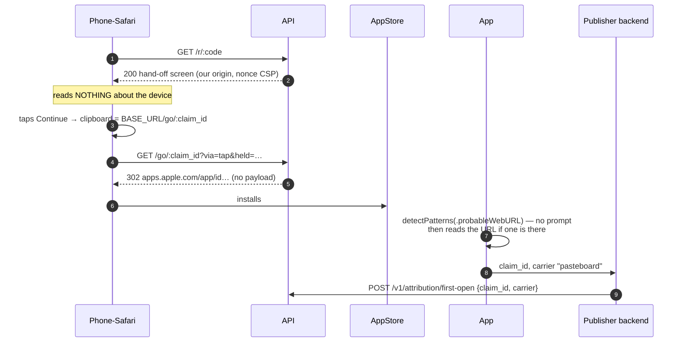

Safari permits a clipboard write only inside a user gesture, so on iOS the tap is the carrier
rather than decoration. `detectPatterns` is documented by Apple as matching *"without notifying
the user"*, so an app only triggers the paste prompt when a URL is actually present — a device
that never scanned anything never sees one.

### The hand-off screen

One HTML page, the only place in this API that runs script, and therefore the only route with a
relaxed CSP — a per-render **nonce**, never `unsafe-inline`.

Everything about it is a fallback around a fallback, because the failure mode is silent (a
scanner who never reaches the store is one the publisher never hears about):

| Situation | Behaviour |
|---|---|
| scanner taps Continue | clipboard written, then `location.replace` |
| clipboard write refused | the hand-off still happens; the install is simply organic |
| nobody taps | a 9 s bail-out sends them to the store **unattributed** — a true answer, not an error |
| script blocked or errors | `<meta refresh>` still lands on the App Store |
| all of it fails | the Continue key is a real anchor to a real URL |

The bail-out is deliberately long, and it does **not** write the clipboard: a write outside a
gesture is refused by Safari anyway, and writing to someone's clipboard when they never touched
the page would be rude even if it worked.

The `claim_id` shape is asserted (`/^[A-Za-z0-9_-]{6,64}$/`) before interpolation into an href
and a script literal — it comes from `randomBytes` so it cannot carry markup, but a change to
the generator must fail here rather than open an injection point.

`GET /go/:claim_id` records how the page was left (`held_ms`, `exit`) and redirects. It refuses
to overwrite once an install has been bound (`WHERE consumed = false`). It is also the exact
string the tap writes to the clipboard — one URL for both jobs, so a scanner who pastes it
somewhere lands on the store listing they were already going to.

### What the reporting layer lost

`exit: 'auto'` on an iOS scan is now the shape of an unattributable install, and it is the
number to watch: it says nobody tapped. A publisher who registered an App Clip but shows a
column of `pasteboard` has a misconfigured association file or URL prefix.

The `screen`, `tz`, `theme` and `network` analytics dimensions are gone, along with `devices`
and `repeat_scans` — all four dimensions were by-products of the fingerprint, and the two
totals were `count(DISTINCT hashed_ip)`. The timezone-based geo inference in the admin scan
table went with them; edge geo and the `Accept-Language` region remain. A coarser answer,
honestly obtained.

### Fraud checks at first open

| Check | Behaviour | Why |
|---|---|---|
| claim already consumed | refuse `already_claimed` | one install per scan, DB-enforced |
| one install, two signups | refuse `already_claimed` | atomic test-and-set on `redeemed` |
| same handset, same campaign | **no longer checked** | it hashed the fingerprint signals; one install per scan is still guaranteed by `scans.consumed` |
| emulator (SDK-asserted) | refuse `device_integrity` before any lookup | the shape of every install farm |
| rooted / jailbroken | **recorded, not refused** | large honest population |
| VPN | **recorded, not refused** | no longer a fraud signal at all — nothing about the network is compared |
| campaign ended/paused | refused at both stages | ending a campaign must stop spend immediately |
| budget exhausted | refused at first open too | so a scan is not burned against a budget that cannot pay |

The repeat-device check is gone with the signals it hashed. Nothing sound was lost: it could
only ever see the probabilistic path, and it worked on a device *shape* — two identical handsets
on one NAT collided, which is why it refused an install rather than banning anything. The
guarantee that actually bounds a print run, one install per scan, is enforced by
`scans.consumed` on a claim id that is unique per scan by construction.

Risk flags are stored on **accepted** installs too — the fraud pattern worth finding is the one
that got paid.

---

## 10. Flow C — engagement (repeat purchase)

The promoter's own booking system is the only party that can know a purchase happened, so it
mints the proof.

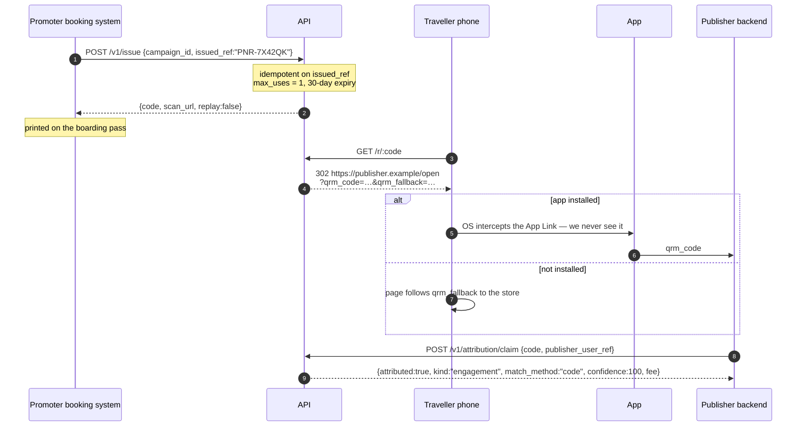

### The reverse of a purchase

A refund, a cancelled ticket or a chargeback un-makes the fact the code was minted against, and
the boarding pass carrying it is already printed. `POST /v1/issue/void` takes the same
`{campaign_id, issued_ref}` the mint took, because a refund webhook knows the PNR and not our
uuid — the portal's void is a human clicking a row on a session, which no booking system has.

It is idempotent, it is **not** a clawback, and it is deliberately unaudited: a refund is routine
at booking volume, while the portal's void means a print run just stopped working and belongs in
the admin's inbox. A code already redeemed stays paid; the answer carries `redeemed: true` so the
promoter reconciles against the fact rather than assuming the void won the race.
`GET /v1/issue?campaign_id=…&issued_ref=…` is the same lookup without the write — the
reconciliation and support call, since re-POSTing the mint replays a code but says nothing about
whether it was scanned, voided or paid.

### Why there is no matching step

Everything in the acquisition flow exists because a phone walks off to a store and has to be
recognised when it comes back. A boarding-pass code skips all of it: the booking system minted
it against a named purchase, the traveller scanned that exact code, and the publisher presents
that exact code back. `match_method = 'code'` and confidence is 100 — not a flattering label,
but the strongest evidence in the system, because a code names a *purchase* rather than a device.

### Why there is no guest tier

`identified` splits an acquisition fee because a brand-new account is worth less until somebody
vouches for it. A repeat customer already transacted with the promoter, which is a harder fact
than any verification bar the publisher could apply. An engagement row is settled on creation
and `/confirm` returns `already_full`.

### Why there is no "is the app installed" check anywhere in this codebase

Both mobile platforms already answer that question — correctly, offline, before the request
leaves the handset. No server can. `deeplink_url` is how the publisher hands that decision to
the OS.

### `code` is never inferred

The engagement Play referrer carries both `qrm_claim` and `qrm_code`, but `claim` reads `code`
only when it is passed **explicitly**. The two are different payouts on different terms, and one
call quietly deciding which the publisher meant is an accounting surprise reconciled by hand
later. A malformed `code` is a 400, never a silent fallthrough to the acquisition path — that
would answer a question about a purchase with an answer about a signup.

### Replay vs. a forwarded screenshot

Two very different situations reach the same UNIQUE violation:

| Situation | Answer | Why |
|---|---|---|
| same code, **same** `publisher_user_ref` | replay the original answer, `replay: true` | the first call succeeded and its response was lost — a timeout, a pod restart, a queue redelivering |
| same code, **different** user | `attributed: false, reason: already_claimed` | that is a forwarded screenshot; replaying would hand a second person the first one's reward |

---

## 11. One scan, two payouts

The case that shapes three database indexes, and the reason engagement is not simply "a second
kind of campaign".

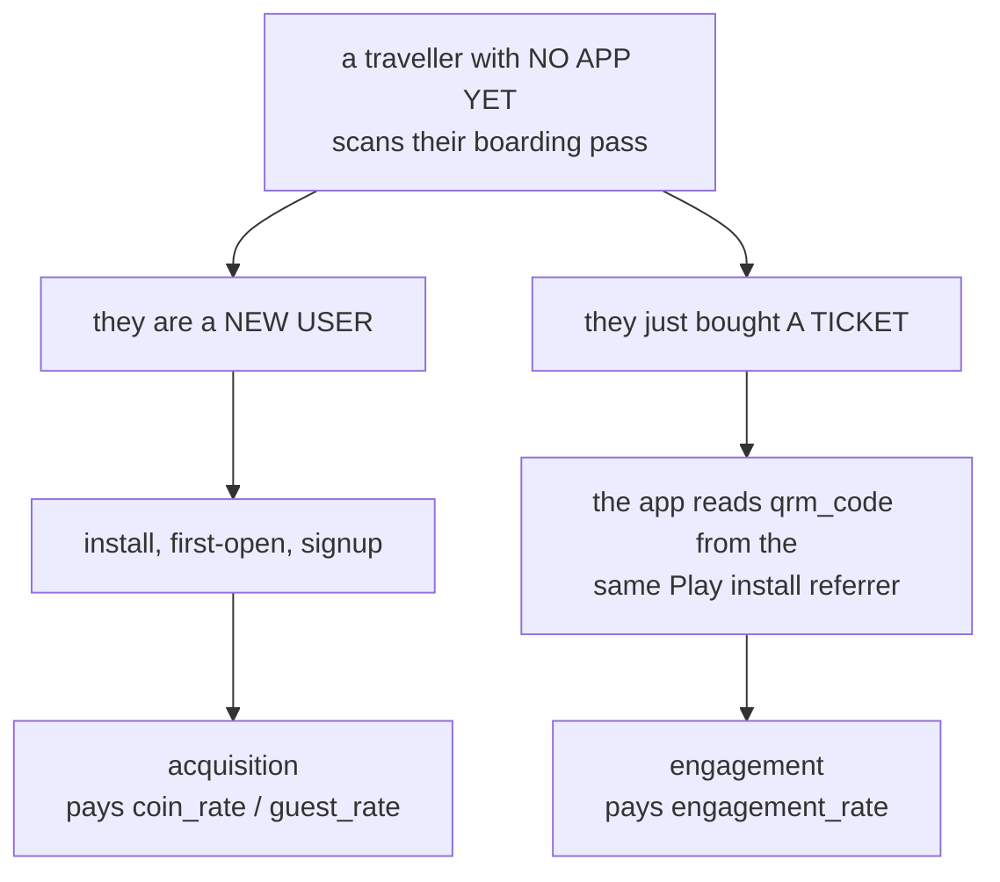

Both are owed. Making that work required the guards to stop sharing a flag:

| Fact | Guard | Scope |
|---|---|---|
| one install per scan | `scans.consumed` | acquisition only |
| one signup per scan | `UNIQUE (scan_id)` | `WHERE kind = 'acquisition'` |
| one signup per user per campaign | `UNIQUE (campaign_id, publisher_user_ref)` | `WHERE kind = 'acquisition'` |
| one reward per issued code | `UNIQUE (qr_code_id)` | `WHERE kind = 'engagement'` |

Before this, a **total** `UNIQUE (scan_id)` meant whichever call arrived second was refused —
and which one that was depended on the publisher's call ordering, which is not a rule anyone can
reason about. Partial indexes make the two facts independent, which is what they always were.

A CHECK ties `kind` to the data: `(kind = 'engagement') = (qr_code_id IS NOT NULL)`, so a row
can never disagree with which of the two partial indexes it is actually living under.

**On iOS the fall-through is weaker, and honestly so.** The App Store has no referrer channel,
so `qrm_code` cannot survive an install. `qrm_fallback` points at `/i/:claim_id` — the same
interstitial an acquisition scan gets — so the *acquisition* half still works. The purchase
reward is lost unless the publisher's own page stashes the code. That is inherent to iOS.

This also has an analytics consequence: the dashboard joins redemptions through a
`LEFT JOIN LATERAL … count(*)` rather than a plain `LEFT JOIN`, because one scan can now carry
two redemptions and a plain join would emit that scan twice and silently inflate every count.

---

## 12. Money

### The ledger

Append-only, double-entry, five account families. Every transfer writes rows under one `ref`
that **sum to zero**.

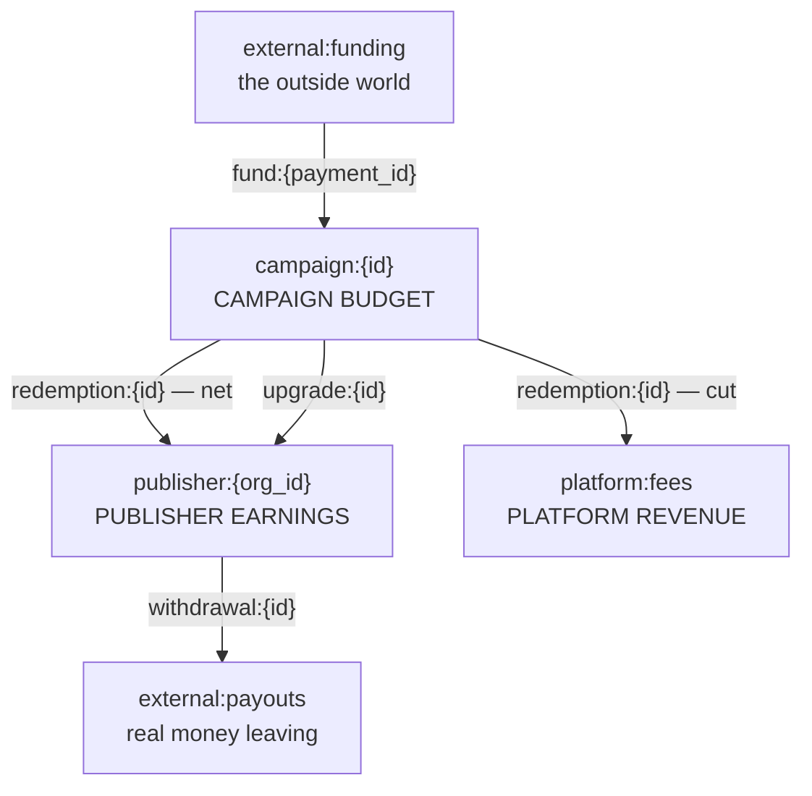

A single payout writes **three** entries under one ref:

```
campaign:{id}      -gross     the promoter's budget spends the agreed rate
publisher:{org}    +net       what the publisher actually earns
platform:fees      +cut       the platform's revenue
```

`splitFee(gross, bps)` floors the cut, so rounding always favours the publisher — the party
being paid for work, and the one who would notice a missing coin. It is a pure function in one
place because two call sites rounding differently is a ledger that fails to sum to zero.

### Four database-level money guarantees

| Guarantee | Mechanism |
|---|---|
| the book is append-only | a Postgres **trigger** raises on UPDATE, DELETE and TRUNCATE. Corrections are compensating entries |
| a retried credit cannot double | `UNIQUE (account, ref)` — the ref shape (`fund:{payment_id}`, `redemption:{id}`, `withdrawal:{id}`) is the idempotency key |
| no account can go negative | `CHECK (balance >= 0 OR account = 'external:funding')` on `account_balances` |
| a campaign cannot overspend | every spend calls `lockedBalance()` = `SELECT … FOR UPDATE` before it writes |

`account_balances` is a **materialised** sum: the ledger is the truth, the balance is the fast
read that every money path locks.

> **A subtle bug worth teaching.** `ledger()` seeds the balance row at 0 and then updates,
> instead of the obvious `upsert`. Postgres evaluates CHECK constraints against the tuple an
> `INSERT … ON CONFLICT DO UPDATE` *proposes*, before it detects the conflict. So an upsert with
> `create: { balance: -10 }` is tested as a standalone `-10` row and rejected by the
> non-negative CHECK — even when the account holds 100 and the result would be a legal 90. That
> made **every debit in the system** fail.

### Money in

```mermaid
sequenceDiagram
    participant P as Promoter
    participant API
    participant PSP
    P->>API: POST /v1/payments/checkout {campaign_id, coins}
    API->>API: INSERT payment (status=pending)
    API-->>P: payment_id
    Note over P,PSP: promoter pays; payment_id travels as PSP metadata
    PSP->>API: POST /v1/payments/webhook + X-Payment-Signature
    API->>API: HMAC-SHA256 over the RAW body, constant-time compare
    API->>API: UPDATE payment WHERE status='pending' (test-and-set)
    API->>API: ledger: external:funding -N, campaign:{id} +N
    API-->>PSP: {status:"completed", replay:false}
```

The shape is PSP-agnostic on purpose: swapping Stripe for SSLCommerz or bKash is an adapter, not
a schema change. Two guarantees, both database-enforced:

- a webhook redelivered N times credits **once** — `status` is flipped by the same UPDATE that
  tests it, and `fund:{payment_id}` collides on `UNIQUE (account, ref)`;
- one PSP charge completes at most one payment — partial unique index on `provider_ref`.

**With no `PAYMENT_WEBHOOK_SECRET` configured the endpoint answers 404.** An unsigned funding
webhook is a mint for whoever finds the URL, so its absence disables money-in entirely rather
than degrading to unauthenticated.

`POST /v1/campaigns/:id/fund` is the demo-only alternative: it credits a budget with no payment
behind it, so `ALLOW_SELF_FUNDING` defaults **off** in production.

### Money out — and the clawback window

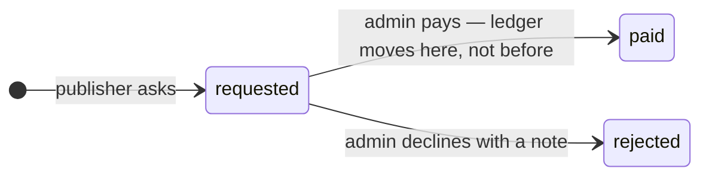

```
withdrawable = balance
             − credits newer than SETTLEMENT_DELAY_DAYS (default 14)
             − coins already queued in `requested` withdrawals
```

This is the number that turns "review the fraud pattern" from advice into a **control**: every
fraud shape the threat model accepts (self-scan, collusion, a disputed attribution) is bounded
by "review runs before real money leaves". Only credits are held — an earlier withdrawal never
extends the wait on what remains.

Both `requestWithdrawal` and `payWithdrawal` lock the balance row, and the pay path flips
`status` with the same UPDATE that tests it, so two admins clicking *pay* at once move the money
once.

### The two-tier acquisition payout

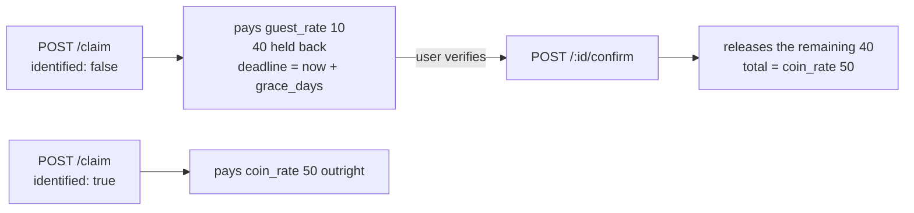

Absent an explicit `identified: true`, the guest tier applies — the promoter never pays full
price for an install nobody vouched for. `confirm` is idempotent (`already_full`), refuses after
the deadline (`grace_period_expired`), re-checks the budget, re-checks that the partnership is
still active, and takes the platform's cut on the delta so the split is the same however the fee
arrived — in one piece or in two.

---

## 13. Concurrency and correctness patterns

Every one of these appears more than once in the codebase. Learning the six is most of the
system.

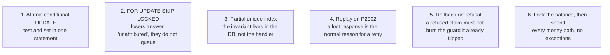

**1. Atomic conditional UPDATE.** `uses = uses + 1 WHERE uses < max_uses`;
`updateMany({ where: { consumed: false }, data: { consumed: true } })` and the same for
`installs.redeemed`, `payments.status`, `withdrawals.status`, and the single-use password-reset
token. The loser sees `count === 0` and is told `already_claimed`. No read-then-write anywhere
on a money path.

**2. `FOR UPDATE … SKIP LOCKED`.** Used on `scans` in both matchers, `installs` in
`claimInstall`, `qr_codes` in `claimCode`. Concurrent claims cannot both proceed; the loser
comes back unattributed, which is correct rather than an error.

**3. Partial unique indexes.** See §11. The handler *turns a constraint violation into an
answer*; the constraint, not the handler, is what guarantees the fee was paid once.

**4. Replay on `P2002`.** Both `claim` paths and `/v1/issue` catch the unique violation and
return the original row with `replay: true`. A 409 would make a correctly-recorded attribution
look like something to reconcile by hand. Note the trap this avoids: inside an *aborted*
Postgres transaction no further query can run, so the id is stashed in a closure variable and
the replay is read **after** the rollback.

**5. Rollback-on-refusal.** `claimInstall` and `claimAtSignup` flip their guard *before* the fee
is known (the fee depends on `identified`). Returning normally from the transaction callback
would commit that flip — so a signup arriving one credit short of the budget would permanently
burn the install, and topping the campaign back up could never make that user attributable
again. A dedicated `Rollback` error is thrown instead, and the caller still answers 200.
`firstOpen` avoids the problem differently: it checks the budget *before* consuming anything.

**6. Lock, then spend.** `lockedBalance(tx, account)` before every debit, in `firstOpen`,
`claim`, `claimPurchase`, `confirm`, and `payWithdrawal`.

---

## 14. Security model

### Trust boundaries

```mermaid
graph TB
    subgraph U["UNTRUSTED — anyone"]
        PHONE["a phone on the scan path"]
        BROWSER["a browser on the portal"]
    end
    subgraph S["SEMI-TRUSTED — authenticated tenants"]
        PBS["publisher backend, pk_ key"]
        PRS["promoter backend, pk_ key"]
        PSPW["PSP webhook, HMAC"]
    end
    subgraph T["TRUSTED"]
        API["the API process"]
        DB[("Postgres — the invariants")]
    end
    PHONE -->|"rate limit 30/min, no auth, no payload out"| API
    BROWSER -->|"JWT + per-request org re-check"| API
    PBS -->|"sha256 key lookup, suspended check, 600/min"| API
    PRS -->|"same, scoped to type='promoter'"| API
    PSPW -->|"constant-time HMAC over raw body"| API
    API --> DB
```

The rule the whole model rests on: **a semi-trusted caller asserts facts about its own users
(`publisher_user_ref`, `identified`, `is_new_user`, `emulator`), and the platform never verifies
those.** What it *does* control is that no assertion can be double-paid, that fees come out of a
budget the promoter actually funded, and that money cannot leave before a review window closes.

### Authentication

| Surface | Mechanism | Notes |
|---|---|---|
| Portal / admin | HS256 JWT, **12 h** | algorithm **pinned** on verify — the one input an attacker controls must never name the scheme it is checked under |
| Every authed request | DB lookup of the org | instant revocation: suspension cuts access now, not when the JWT expires. Role is read from the DB too, so a demotion takes effect immediately |
| Partner / Issuance | `pk_` + 24 random bytes, stored as **sha256** | shown once at signup; `POST /v1/api-keys/rotate` invalidates the old one immediately |
| Key scoping | `orgFromKey(auth, type)` | one function, because the only difference is which `type` the row must have. Two copies of an auth check is two places to forget `suspended: false` |
| PSP webhook | HMAC-SHA256 over the **raw** body, `timingSafeEqual` | re-serialising the parsed body is not what was signed — hence `verify` stashing `rawBody` |
| `/metrics` | bearer token, `timingSafeEqual` | 404 when unset; a `!==` compare leaks the prefix to a patient prober |
| Password reset | admin-issued token, stored hashed with an expiry | single-use via the same UPDATE that matches it |

### Password handling

- bcrypt cost 10.
- **Max 72 bytes, rejected not truncated** — bcrypt silently ignores everything past 72, so
  without the ceiling any string sharing a long passphrase's first 72 bytes would log in.
- Login hashes against a `DUMMY_HASH` when the account does not exist, so an unknown email costs
  the same ~100 ms as a known one. Otherwise timing is a reliable oracle for enumerating exactly
  which addresses are registered.
- Login body values are **coerced, not validated** — answering 400 for a non-string email would
  tell a prober something 401 does not.

### Authorization

Tenant isolation is expressed **inside the WHERE clause**, never as a post-fetch check:

```ts
where: { id: campaign_id, partnership: { promoter_org_id: s.org_id } }   // 404, not 403
```

Someone else's campaign is a **404**, because a permission error is an existence oracle across
tenants. The same applies to `claimCode`, where four different situations (unknown code, voided,
another publisher's, never scanned) collapse into one `no_match` — telling them apart would let
a publisher probe which codes exist platform-wide.

Privilege split, and it is deliberately asymmetric:

| Action | Promoter | Publisher | Admin |
|---|---|---|---|
| void a code (tighten) | ✅ | — | ✅ |
| extend expiry / raise max_uses / un-void (**loosen**) | ❌ | — | ✅ audited |
| adjust a budget | ❌ | — | ✅ audited |
| suspend a partnership | ❌ | ❌ | ✅ audited |
| pay a withdrawal | — | request only | ✅ audited |

Promoters may tighten their own codes but never loosen them — loosening is a money control.

### Rate limiting

| Key | Limit / min | Guards |
|---|---|---|
| `global:{ip}` | 300 | the floor under every route, so a route added later is never accidentally unlimited |
| `scan:{ip}` | 30 | the hot path |
| `go:{ip}` | 30 | interstitial hand-off and `/i/:claim_id` |
| `qr-image:{ip}` | 120 | unauthenticated and CPU-bound (QR encode + SVG build) |
| `signup:{ip}` | 10 | |
| `login-ip:{ip}` | 20 | credential stuffing across many accounts |
| `login-acct:{email}` | 10 | distributed brute force against one account |
| `reset:{ip}` | 10 | |
| `partner:{sha256(key)}` | 600 | machine callers, generous enough that no honest flow hits it |

Three design notes:

- **The global limit is keyed on IP alone, not on the session** — an attacker without a valid
  token is exactly the one to slow down, and they have no session to key on.
- **The account key is sliced to 254 chars** before becoming a retained map key: a body full of
  1 MB emails would otherwise be a megabyte of resident memory per request.
- **Redis failure degrades, it does not fail open.** On an error the limiter falls back to the
  in-process window — per-instance limits, which is what the deployment had before Redis
  existed, rather than no limits at all. It logs at `warn` because it silently weakens a
  security control. An earlier version read the pipeline result without checking its
  `[error, result]` tuple; `undefined > 300` is `false`, so every request passed and nothing was
  logged.

### `TRUST_PROXY` — the setting that can void every limit above

Every per-IP control reads `req.ip`, and `req.ip` is whatever this setting says to believe.
`true` means "trust `X-Forwarded-For` from anyone", which lets a client name its own address:
one attacker becomes unlimited distinct IPs and every limit evaporates. Express accepts it
happily, so **`config.ts` throws at boot** if it is set. Name the real hops (`1` for one load
balancer) or the proxy subnet.

### Input validation at the boundary

`str(v, name, max, required)` is used on every free-text field crossing a trust boundary. It
**rejects rather than truncates** — a `publisher_user_ref` quietly cut to 200 chars would
collide with a different user's ref and hand one user's attribution to another. It also rejects
NUL bytes, which Postgres cannot store and would otherwise abort a transaction mid-flight.

Redirect targets are pre-approved destinations, not free text: `landing_url` and `deeplink_url`
must be absolute, **https** (http for localhost only), and carry no embedded credentials. That
kills `javascript:` / `data:` redirect XSS and stops a scan being downgraded to cleartext.
`android_package` and `ios_app_id` are pattern-checked in the API **and** by CHECK constraints,
because they are interpolated into the store URL a scan redirects to.

`slug` and `ios_appclip_id` are pattern-checked in the API **and** by CHECK constraints for a
sharper reason: `ios_appclip_id` is served to every iPhone that scans anything, in one shared
association document, so a single malformed entry would invalidate the file and silently break
App Clip invocation for every publisher at once.

What a publisher's server sends at first open is now one field — the claim id — and its shape is
asserted before it reaches the database. There are no device signals left to bound.

### Response headers

```
Content-Security-Policy: default-src 'none'; frame-ancestors 'none'; base-uri 'none'
X-Content-Type-Options: nosniff
X-Frame-Options: DENY
Referrer-Policy: no-referrer
Cross-Origin-Resource-Policy: same-site
Strict-Transport-Security: max-age=31536000; includeSubDomains   (production)
```

`default-src 'none'` is what makes the QR image endpoint safe: it renders attacker-supplied SVG
(logo data URLs) from our own origin, and CSP + `nosniff` stop that SVG executing script when
loaded directly. `no-referrer` keeps scan URLs out of onward `Referer` headers, so a store
listing never learns which code sent the visitor. The interstitial replaces this with its own
nonce policy and `Cache-Control: no-store`.

### Boot-time refusals (fail fast, not fail quiet)

Production refuses to start when:

| Condition | Why |
|---|---|
| `JWT_SECRET` is the dev default | a total auth bypass |
| `BASE_URL` / `FRONTEND_URL` unset | `BASE_URL` is encoded into printed QR codes — a wrong value is a **reprint**, not a redeploy |
| either is not `https://` | scans are redirected over those origins |
| `DATABASE_URL` unset | the dev fallback would target localhost, or worse, some other database |
| `TRUST_PROXY=true` | see above |
| `ADMIN_PASSWORD` < 12 chars, `METRICS_TOKEN` < 16, `PAYMENT_WEBHOOK_SECRET` < 16 | |

And three production defaults that flip **off**: `ENABLE_DOCS`, `ALLOW_SELF_FUNDING`,
`AUTO_APPROVE_PUBLISHERS`. Publishers *receive money*, so "sign up, look legitimate, receive
money" must not be one unauthenticated flow. Promoters gate themselves with their own budget.

### Threat model

| Threat | Control | Residual risk |
|---|---|---|
| QR reused / photographed | `max_uses`, expiry, atomic claim, void | a shared code still pays its **first** claimant only |
| Replayed claim id | `scans.consumed` + `installs.scan_id` UNIQUE | none |
| One install, two signups | test-and-set on `installs.redeemed` | none |
| Same user claimed twice | `UNIQUE (campaign_id, publisher_user_ref)` partial index | a returning user with a fresh ref — mitigated by the publisher's `is_new_user: false` assertion |
| Install farm | emulator refusal; one install per scan; a claim id that must have been carried from a real scan | real, and narrower than it was: a farm that can scan a poster and carry the claim is indistinguishable from a customer. Bounded by `max_uses` and budget |
| Mis-attribution on shared NAT | **eliminated** — nothing is matched on the network any more | none; the cost was moved to coverage instead, as unattributed installs |
| Publisher lies about `identified` | two-tier payout + settlement window | accepted — bounded by clawback |
| Promoter self-scans its own campaign | it spends its own funded budget | accepted; it costs the promoter money |
| Collusion promoter↔publisher | audit log, admin overview, 14-day settlement hold | accepted — bounded by "review before money leaves" |
| Credential stuffing | per-IP + per-account throttles, constant-time login | |
| Stolen API key | sha256 storage, instant rotation, suspension checked per call | the key never expires on its own — rotation is the only end |
| Unsigned funding webhook | endpoint 404s without a secret | |
| Multi-replica limit dilution | Redis-shared counters | **operational**: N replicas without `REDIS_URL` is N× every security limit |

---

## 15. Compliance: why the QR unlocks nothing, and why nobody is fingerprinted

Four separations, each enforced by code rather than by policy language:

```mermaid
graph TB
    A["1. The QR is a measurement artifact, not a key<br/>a scan resolves to a store listing, an App Clip or the publisher's app link.<br/>What travels is an opaque lookup key, inert without the<br/>publisher's server-side API key."]
    B["2. What moves between companies is a marketing fee<br/>platform credits, promoter → publisher.<br/>Nothing is credited to an end user, by anyone, anywhere."]
    C["3. The joining bonus is the publisher's own<br/>/claim answers 'is this attributable?' — no amount,<br/>no instruction to grant. bonuses is a list the<br/>publisher writes about itself."]
```

```mermaid
graph TB
    D["4. Nothing is derived from the device<br/>every match is an opaque claim id the platform minted,<br/>carried by Play's referrer, an App Clip container or the pasteboard.<br/>No timezone, screen, locale, core count or network is read, stored or compared."]
```

The e2e suite asserts all of this structurally. An acquisition scan redirect containing
anything that looks like a spendable token fails the build; so does a hand-off screen whose
source mentions `hardwareConcurrency`, `deviceMemory`, `devicePixelRatio`, `resolvedOptions`,
`maxTouchPoints` or `colorDepth`. The App Clip's JSON response is checked against an
allow-list of keys rather than a blocklist, because it is the one response in the system that
hands a claim id to a device.

`attribution.test.ts` additionally asserts that `score`, `decide`, `WEIGHTS`, `BASE` and the
`norm*` signal parsers have not returned to the module's exported surface — the fingerprinting
path is not just deleted, its names are load-bearing absences.

### Where the argument gets thinner — say this out loud

Engagement mode puts `qrm_code` in the app's hands, and the user-visible experience is closer to
"scan a code, get something" than any acquisition scan ever was.

**What still holds**: the code is an opaque transaction reference, single-use, short-lived,
minted server-side against a purchase the promoter already took money for, and worth nothing to
anybody who cannot present it *with the publisher's server-side API key*. That is the same trust
model as Play's install referrer, which every attribution SDK on both stores relies on.

**What genuinely changed**: the user is scanning something they were handed *because they bought
a ticket*, and something good happens in the app afterwards. Whether store operators read that
as measurement or as an unlock mechanism is not a question this codebase can settle. The e2e
assertion had to be scoped to acquisition scans, and that scoping is the compliance surface.

**Recommendation**: have this reviewed before shipping engagement campaigns to a store-listed
app. Three things the platform cannot enforce, which belong in the integration agreement:

- no in-app "scan a QR for coins" flow and no in-app scanner tied to this system — the QR lives
  on printed media and is scanned with the phone's own camera;
- the bonus must be a genuine free grant, not a purchase routed around IAP;
- `qrm_code` must be consumed by the app's backend and never shown to the user as a redeemable
  value — it is plumbing, not a coupon.

---

## 16. Observability and operations

### The failure this system is built to catch is silent

A publisher who types their `android_package` wrong generates **no errors**. Every install looks
organic, the matcher answers `no_match` forever, and nobody is paid. There is no exception to
alert on and no row to count, because refusals are never persisted — `installs` and
`redemptions` only ever record what *succeeded*.

So the refusal rate is emitted rather than stored:

```mermaid
graph LR
    D["every attribution decision<br/>paid or refused"] --> M["counter<br/>attribution_decisions_total<br/>{stage, reason, match_method}"]
    D --> L["structured log line<br/>with campaign_id, publisher_org_id,<br/>fee, confidence"]
    M --> P["/metrics — Prometheus, token-gated"]
    L --> PIPE["stdout JSON → log pipeline"]
```

| Piece | Implementation | Why not a library |
|---|---|---|
| request id | `AsyncLocalStorage`, echoed as `X-Request-Id` | exactly what ALS is for; a logging library is a dependency for the same thing |
| structured logs | one `JSON.stringify` per line, errors to stderr | the whole feature is four lines, and `console` preserves stdout ordering |
| metrics | Prometheus text format rendered by hand | `name{label="v"} 123` plus a TYPE header — a client library would be a dependency for string concatenation |

Two rules that keep this cheap:

- **Metric labels are closed sets only** (a reason, a method, a status class). Anything unbounded
  — campaign id, user ref, a path with ids in it — goes to the log, where one line costs one
  line rather than a permanent new time series. Route labels use `req.route.path` (the *pattern*
  `/r/:code`), never the resolved URL.
- **Per-process counters reset on restart, and that is correct.** Prometheus scrapes each
  instance separately and `rate()` already accounts for resets.

An inbound `X-Request-Id` is honoured (bounded and charset-stripped) so a trace started by a
publisher's own server survives into these logs. When a publisher reports "this claim did not
attribute", that header is the whole investigation.

### Alerting

```mermaid
graph TB
    R["startReconciliation()<br/>every 10 min + once at boot"] --> Q["one query:<br/>sum(ledger_entries) = 0 ?<br/>any account_balance ≠ its entries ?"]
    Q -->|"sum ≠ 0"| A1["alert ledger.unbalanced"]
    Q -->|"drift > 0"| A2["alert ledger.balance_drift"]
    PAY["payout()"] -->|"remaining < 10× fee"| A3["alert campaign.budget_low"]
    A1 & A2 & A3 --> OUT["log.error always<br/>+ POST {text} to ALERT_WEBHOOK_URL"]
```

Drift means something is spending against a wrong number, and it must not wait for someone to
open a dashboard — hence a clock rather than a page load. A budget about to run dry means a
promoter's live print run is about to start bouncing to `/campaign-ended`. The alert channel
failing must never take the money path with it, so webhook errors are caught and logged.

### Health, deployment, durability

- `GET /healthz` runs `SELECT 1` and returns **503** if Postgres is unreachable — a process that
  cannot reach the DB serves nothing but 500s and should be pulled from rotation.
- Compose runs `db`, `api`, `web`, and a **backup sidecar** doing a nightly `pg_dump`, keeping 14
  days. The ledger is the one thing that cannot be re-derived.
- Both services expect a TLS-terminating proxy in front; the API refuses to boot with `http://`
  URLs in production.
- Scaling `api` past one replica **requires `REDIS_URL`** — the per-IP limits are security
  controls counted per process.

### Tests

| Suite | Covers |
|---|---|
| `backend/test/*.ts` | security helpers, QR rendering, attribution scoring, signal parsing, observability, money maths — all pure, no DB |
| `frontend/test/*.ts` | units, theme contrast |
| `e2e-test.sh` | the full business loop against a running stack: real HTTP, no mocks — partnership, repricing, funding, both scan platforms, both products, fraud refusals, ledger integrity, admin overrides |

The e2e script queries the same database the API is using rather than a hardcoded container, and
that matters: hardcoding made every ledger assertion pass **vacuously** against an empty database
whenever `DATABASE_URL` pointed elsewhere.

---

## 17. Failure modes

| If this breaks | Then | Designed response |
|---|---|---|
| Postgres unreachable | everything fails | `/healthz` 503 → out of rotation |
| Redis unreachable | limits become per-instance | fall back to the in-process window, log `warn` |
| Alert webhook down | alerts still hit stdout as `error` | caught, never blocks a payout |
| PSP webhook redelivered | credits once | test-and-set + `UNIQUE (account, ref)` |
| Publisher retries `claim` | replays the original answer | `replay: true`, no second payment |
| Two claims race one scan | one wins | `SKIP LOCKED`; the loser gets `unattributed` |
| Budget hits zero mid-run | scans stop redirecting | `/campaign-ended?reason=budget`; claims refuse and **roll back** so nothing is burned |
| Publisher misconfigures their store target | no errors anywhere | visible only as `no_match` → 100% on the decision metric |
| Deploy lands mid-transaction | in-flight requests drain first | `SIGTERM` handler closes the app before exit |
| Interstitial script blocked | no signals collected | `<meta refresh>` still reaches the store; the match then scores 55 and is *correctly* refused |

---

## 18. API surface

| Surface | Auth | Called by |
|---|---|---|
| `POST /v1/auth/signup`, `/login`, `/reset` | none | anyone |
| `GET /r/:code` | none | phones, on scan (30/min) |
| `GET /i/:claim_id`, `GET /go/:claim_id` | none | the interstitial (30/min) |
| `GET /v1/qr-codes/:id/image`, `POST /:id/preview` | none | QR preview and print downloads (120/min) |
| `GET /healthz` | none | load balancer |
| `GET /metrics` | bearer token | Prometheus |
| `/v1/*` portal routes | session JWT, 12 h | promoter + publisher dashboards |
| `/v1/attribution/*` | `pk_…` | the **publisher's server** — never a browser, never the app |
| `POST /v1/issue`, `GET /v1/issue`, `POST /v1/issue/void` | `pk_…` | the **promoter's server** — one call per transaction, plus lookup and refund |
| `POST /v1/payments/checkout`, `GET /v1/payments` | session JWT | promoter |
| `POST /v1/payments/webhook` | HMAC signature | the PSP |
| `/v1/admin/*` | session JWT + `admin` role | super admin console |

Everything sits under the 300/min per-IP ceiling; `/healthz` and `/metrics` are exempt.

### Attribution refusal reasons — the vocabulary a publisher integrates against

| `reason` | Means | What the publisher should do |
|---|---|---|
| `no_match` | organic install, or the window expired — the common case | nothing; continue signup |
| `already_claimed` | that scan, install or code was already matched | nothing |
| `device_integrity` | SDK asserted an emulator | nothing |
| `campaign_not_active` | paused or ended after the scan | nothing |
| `budget_exhausted` | the promoter's budget ran out | nothing; we fail closed |
| `install_expired` | signup window elapsed | nothing |
| `not_engagement` | a `code` from an acquisition campaign | fix the call |
| `not_a_new_user` | the publisher asserted `is_new_user: false` | nothing |

**`attributed: false` is a 200 and never means "reject this signup".** The user signed up; that
happened regardless of who gets paid for it.

---

## 19. Configuration reference

| Variable | Default | What it controls |
|---|---|---|
| `BASE_URL` | — (required in prod) | **encoded into printed QR codes** |
| `FRONTEND_URL` | — (required in prod) | CORS allowlist + redirect origin |
| `DATABASE_URL` | — (required in prod) | Postgres |
| `REDIS_URL` | unset | shared rate-limit counters; **required past one replica** |
| `TRUST_PROXY` | `loopback` | which hops may set `X-Forwarded-For`; `true` is refused |
| `JWT_SECRET` | dev default | session signing; the dev value is refused in prod |
| `REFERRER_WINDOW_DAYS` | 30 | scan → first open, deterministic |
| `SIGNUP_WINDOW_DAYS` | 30 | first open → signup |
| `PLATFORM_FEE_BPS` | 1000 (10%) | take rate, **snapshotted per partnership at creation** |
| `SETTLEMENT_DELAY_DAYS` | 14 | the clawback window before earnings are withdrawable |
| `PAYMENT_WEBHOOK_SECRET` | unset | unset ⇒ money-in is off (404) |
| `METRICS_TOKEN` | unset | unset ⇒ `/metrics` 404s |
| `ALERT_WEBHOOK_URL` | unset | Slack-compatible alert sink |
| `ENABLE_DOCS` | off in prod | unauthenticated Swagger is reconnaissance |
| `ALLOW_SELF_FUNDING` | off in prod | budgets with no payment behind them |
| `AUTO_APPROVE_PUBLISHERS` | off in prod | publishers receive money — a human looks first |

Two are worth calling out as *business* levers rather than tuning knobs: `PLATFORM_FEE_BPS` is
the revenue model, and it is snapshotted so a config change never reprices an agreed deal;
`SETTLEMENT_DELAY_DAYS` is what makes every accepted fraud risk bounded.

---

## 20. Teaching aids

### The ten sentences that carry the design

1. The QR unlocks nothing; everything else follows from that.
2. A scan is an attribution *claim*, not a transaction.
3. Four stages, four tables — because a scan→open gap is minutes and an open→signup gap is days.
4. Deterministic first, and **never** fall back from it: a failed exact lookup must not become a
   guess.
5. Every match is deterministic; there is nothing to fall back *to*, and that absence is the design.
6. A platform rule written on *purpose* is not satisfied by moving where the collection happens.
7. Unattributed is a 200; most installs are organic and "we don't know" is the honest answer.
8. The invariants live in the database — partial unique indexes, CHECKs, an append-only trigger —
   so they hold under concurrency rather than under code review.
9. A retry replays; it never re-pays. The constraint, not the handler, guarantees payment once.
10. Money cannot leave until the review window closes.

### Exercises

1. **Trace a payout.** A traveller scans a boarding pass on an Android phone with no app
   installed. List every row written and every ledger entry, in order, with the guard each one
   passes. (Answer: §10 + §11 + §12 — two redemptions, two ledger refs, six entries.)
2. **Break it.** Where would you add a `try/catch` that quietly turns a refusal into a payout?
   (Hint: §13 pattern 5.)
3. **Reason about a race.** Two `POST /claim` calls for the same `install_id` arrive
   simultaneously. Which line decides the winner, and what does the loser see?
4. **Reject a signal.** A publisher asks you to match iOS installs on battery level and
   accelerometer noise "since it's just a fallback, and we'll ask for consent". Give the two
   sentences from Apple's guidance that settle it, and say why collecting it on the web instead
   of in the app would not have helped. (§9)
5. **Find the compliance edge.** Which single line of the e2e suite had to be scoped when
   engagement mode shipped, and what did that scoping concede?
6. **Operate it.** `attribution_decisions_total{reason="no_match"}` jumps to 100% for one
   publisher. Name three causes and how you would tell them apart from the logs.

### Where to read the code

| To understand | Read |
|---|---|
| the scan hot path | `backend/src/modules/public/public.controller.ts` |
| the interstitial and its fallbacks | `backend/src/modules/public/interstitial.ts` |
| matching, scoring, refusals | `backend/src/common/attribution.ts` (pure) |
| both payout paths, all the races | `backend/src/modules/partner/partner.controller.ts` |
| code minting | `backend/src/modules/partner/issue.controller.ts` |
| the ledger and the split | `backend/src/database/ledger.ts`, `backend/src/common/rates.ts` |
| every security helper | `backend/src/common/security.ts` |
| every invariant | `backend/prisma/migrations/*/migration.sql` |
| the whole loop, executable | `e2e-test.sh` |
